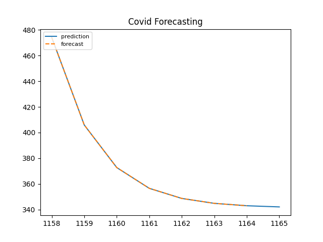
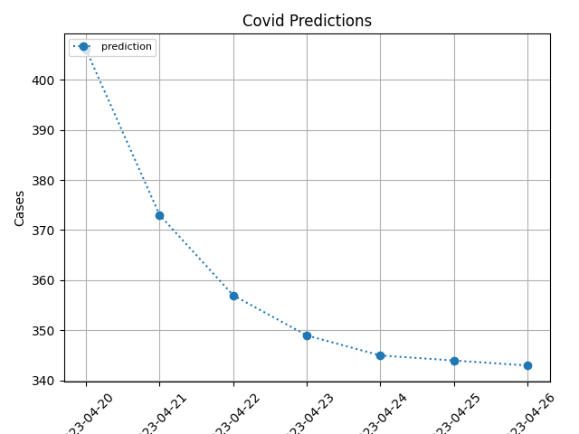

# CovidPredictor
Using the ARIMA model to predict daily new Covid cases for the next 7 days

Using BeautifulSoup I have webscraped the Worldometer website for all recorded data for South Africa.

With this data I have trained and predicted the next 7 days of new covid cases.

The prediction is displayed using FastAPI in JSON format {date, new_cases} respectively.

PLEASE NOTE: I am only predicting 7 days from the final day that Worldometer recorded new cases on a daily basis. From what I have seen Wolrdometer stopped recording new data in April 2023.

- Statsmodels (ARIMA)
- Numpy
- Sci-kit Learn
- Matplotlib
- BeautifulSoup
- FastAPI
- Pandas
- Uvicorn
